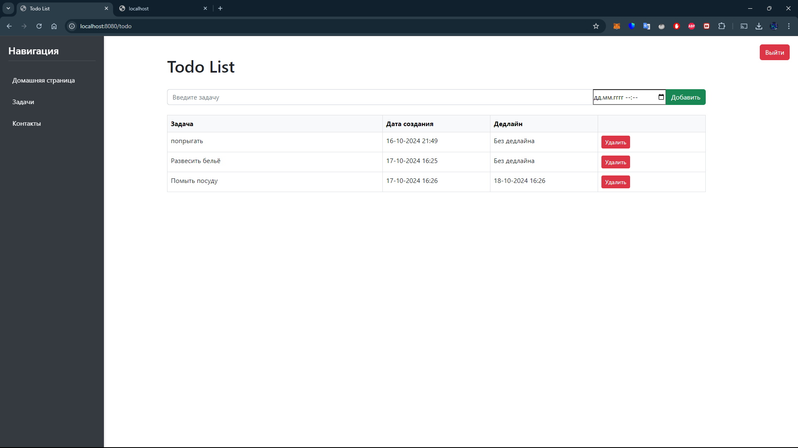

# Todo Application

## Описание
Todo Application — это многофункциональное приложение для управления задачами, разработанное с использованием Spring Framework. Приложение позволяет пользователям создавать, редактировать, удалять задачи и организовывать их для повышения эффективности и продуктивности.

## Технологии
- Java 17
- Spring Boot
- Spring Data JPA
- Hibernate
- PostgreSQL
- Thymeleaf (для фронтенд-шаблонов)
- Lombok
- Maven

## Основные возможности
- Регистрация и авторизация пользователей
- Добавление, редактирование и удаление задач
- Возможность организации задач по категориям и приоритетам
- Отметка выполненных задач
- Поддержка многопользовательской работы

## Установка и запуск проекта
### Требования
- Java 17+
- Maven 3+
- PostgreSQL

### Инструкция по установке
1. Клонируйте репозиторий:
   ```sh
   git clone https://github.com/ваш_аккаунт/todo-app.git
   ```

2. Перейдите в папку проекта:
   ```sh
   cd todo-app
   ```

3. Создайте базу данных в PostgreSQL:
   ```sql
   CREATE DATABASE todo_app;
   ```

4. Настройте файл `application.properties`, указав свои данные для подключения к базе данных:
   ```properties
   spring.datasource.url=jdbc:postgresql://localhost:5432/todo_app
   spring.datasource.username=ваш_пользователь
   spring.datasource.password=ваш_пароль
   spring.jpa.hibernate.ddl-auto=update
   ```

5. Соберите и запустите приложение с помощью Maven:
   ```sh
   mvn spring-boot:run
   ```

6. Откройте браузер и перейдите по адресу [http://localhost:8080](http://localhost:8080) для работы с приложением.

## API

- **GET /tasks**: Получение всех задач.
- **GET /tasks/{id}**: Получение задачи по ID.
- **POST /tasks**: Создание новой задачи.
- **DELETE /tasks/{id}**: Удаление задачи по ID.


## Скриншоты!





## Авторы
- Данил kondratovo21088@mail.ru